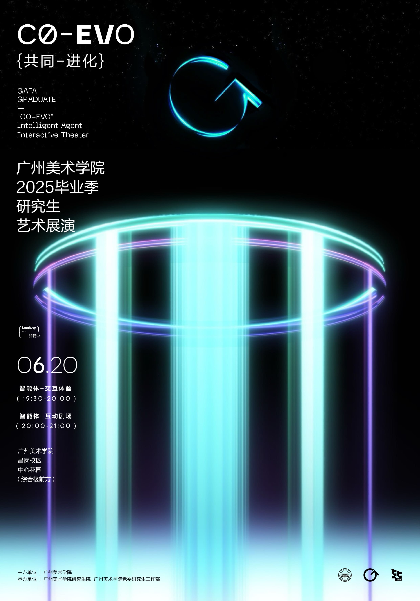
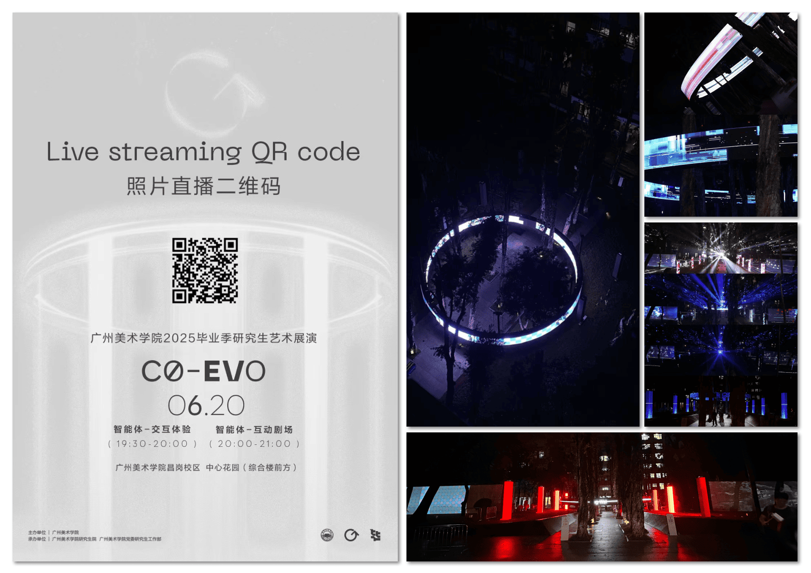
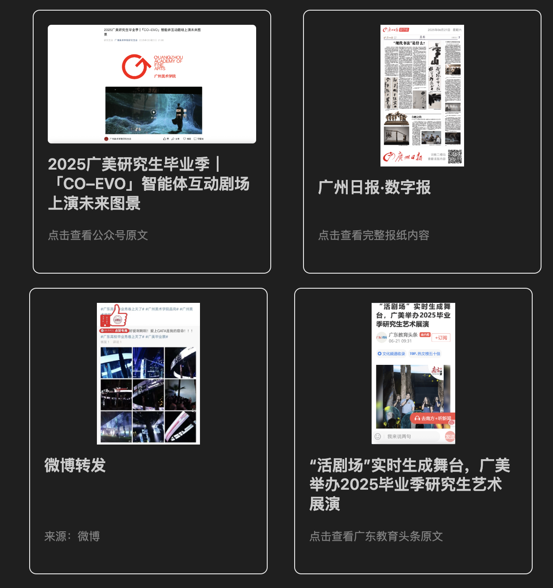
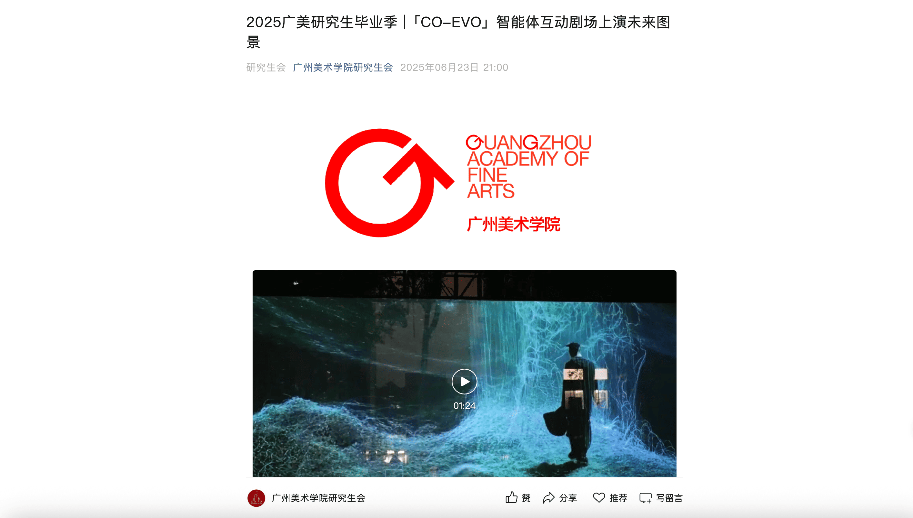
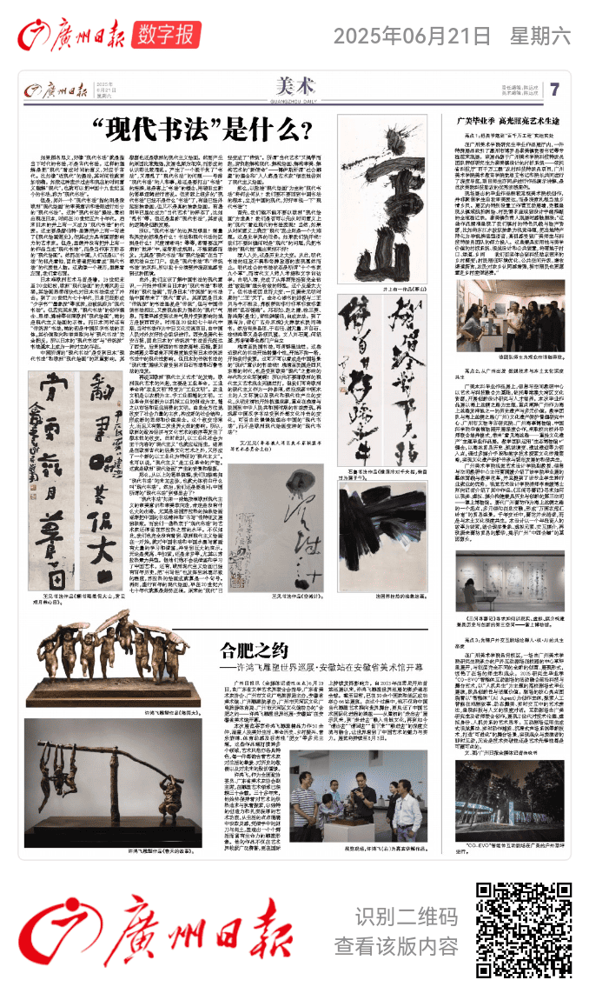
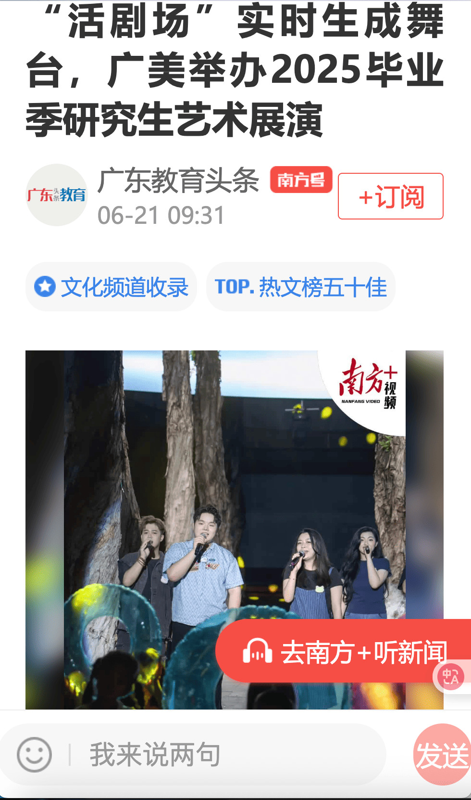
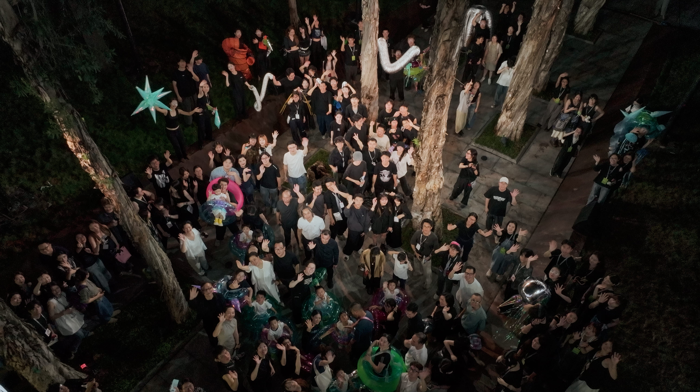
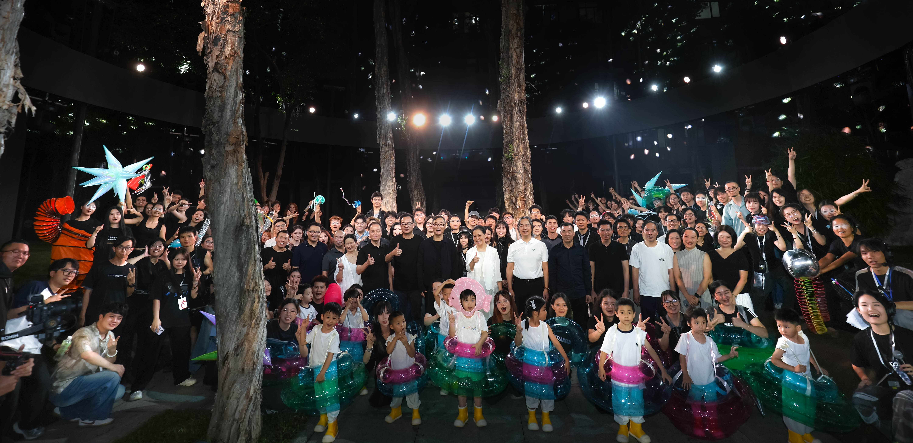

# 2025广美研究生毕业季 |「CO-EVO」智能体互动剧场｜序幕

## 「序幕：呼吸·感知觉醒」
- 「CO-EVO」序幕是2025广美研究生毕业季的互动装置项目。
- 该项目通过实时互动技术，展现智能体与观众之间的共生关系，构建一个沉浸式的剧场生态系统。

 

序幕展现了智能体的初始状态。遍布现场的高清摄像头作为智能体感知世界的瞳孔，实时捕捉现场画面，将动态信息即时转化为光影、色彩，呈现于幕布之上。观众通过智能体的“观察-学习-生成”行为，传递情感算法，与现场产生联结，逐渐构成展演的剧场生态。

## 项目结构
整个序幕系统分为两大部分：
- **中心圆环（RingScreen）**
    - 负责实时人群情绪分析与可视化，大模型对情绪数据进行分析，生成情感算法，通过 OSC 协议将数据发送至 TouchDesigner 进行视觉化呈现。
- **两旁侧幕（SideScreen）**
    - 负责人群追踪与实时字母（G/A/F）检测，加入大模型对话，实现互动内容展示。

---

## 一、中心圆环（RingScreen）
 
### 功能简介
- 利用高清摄像头采集现场观众的人脸表情，实时分析群体情绪状态。
- 通过算法对情感数据进行聚合与分类，并通过 OSC 协议将数据发送至     140TouchDesigner 进行视觉化呈现。
- 主要程序：`emotion_detect_normalize_ai_ver2.py`
  - 实时人脸检测与情绪分析
  - 情绪数据聚合与分类
  - OSC 消息发送

### 互动方式
- 观众的表情会被系统实时捕捉，情绪状态影响中心圆环的光影与色彩变化，形成观众与剧场空间的情感联结。

---


## 二、两旁侧幕（SideScreen）
 
### 功能简介
- 基于 YOLOv8，实现对 G、A、F 字母的实时检测与追踪。
- 集成 OpenAI Vision 功能与 OSC 通信，将识别结果实时传递给互动展示系统。
- 主要程序：基于 Python，配合 shell 脚本一键运行。
- 支持多平台环境配置（Windows/conda、Mac/Linux/venv）。

### 互动方式
- 观众可通过现场动作等方式参与字母的展示与互动。
- 系统实时追踪字母的出现与移动，触发两侧幕布的视觉反馈，与观众产生动态互动。

---

## 三、如何部署与运行
### 环境配置
- 中心圆环（RingScreen）推荐使用 Python 虚拟环境（venv）。
- 侧幕（SideScreen）推荐使用 Conda 环境，支持 Windows/Mac/Linux。

### 快速启动
#### RingScreen
```bash
# 创建虚拟环境
python -m venv .venv
source .venv/bin/activate
pip install -r requirements.txt

# 运行主程序
python emotion_detect_normalize_ai_ver2.py
```

#### SideScreen
```bash
# 建议使用 conda 环境
conda env create -f environment.yml
conda activate gaf_env

# 一键运行
./run_gafa.sh
```

---

## 四、互动体验说明
- 观众通过表情与动作影响剧场空间的视觉与氛围，系统将观众的“观察-学习-生成”行为转化为情感算法，实时反馈于中心圆环与两旁侧幕。
- 所有互动数据均通过 OSC 协议进行实时传输，确保多屏联动与现场交互的流畅性。

## 五、现场照片





## 六、媒体报导



<!-- 
<div style="display: flex; justify-content: space-between; gap: 16 px; align-items: stretch;">


  <div style="border:1px solid #eaeaea; border-radius:8px; padding:16px; width:45%; box-sizing: border-box; display: flex; flex-direction: column;">
    <a href="https://mp.weixin.qq.com/s/CkJv35DpV85Ugf_CsPwQtg" target="_blank" style="text-decoration:none; color:inherit; display: flex; flex-direction: column; height: 100%;">
      
      <h3 style="margin-top:12px;">2025广美研究生毕业季｜「CO–EVO」智能体互动剧场上演未来图景</h3>
      <p style="color:gray; font-size:0.9em; margin-top:auto;">点击查看公众号原文</p>
    </a>
  </div> 
  
 
  <div style="border:1px solid #eaeaea; border-radius:8px; padding:16px; width:45%; box-sizing: border-box; display: flex; flex-direction: column;">
    <a href="https://newspaper.gzdaily.cn/h5/html5/2025-06/21/content_872_889486.htm?curr=" target="_blank" style="text-decoration:none; color:inherit; display: flex; flex-direction: column; height: 100%;">
      
      <h3 style="margin-top:12px;">广州日报·数字报</h3>
      <p style="color:gray; font-size:0.9em; margin-top:auto;">点击查看完整报纸内容</p>
    </a>
  </div>
</div>

<p></p>

<div style="display: flex; justify-content: space-between; gap: 16 px; align-items: stretch;">


  <div style="border:1px solid #eaeaea; border-radius:8px; padding:16px; width:45%; box-sizing: border-box; display: flex; flex-direction: column;">
    
    <h3 style="margin-top:12px;">微博转发</h3>
    <p style="color:gray; font-size:0.9em; margin-top:auto;">来源：微博</p>
  </div>


  <div style="border:1px solid #eaeaea; border-radius:8px; padding:16px; width:45%; box-sizing: border-box; display: flex; flex-direction: column;">
    <a href="https://static.nfnews.com/content/202506/21/c11423577.html?colID=0&firstColID=3829&appversion=12400&from=weChatMessage&enterColumnId=&date=&layer=2" target="_blank" style="text-decoration:none; color:inherit; display: flex; flex-direction: column; height: 100%;">
      
      <h3 style="margin-top:12px;">“活剧场”实时生成舞台，广美举办2025毕业季研究生艺术展演</h3>
      <p style="color:gray; font-size:0.9em; margin-top:auto;">点击查看广东教育头条原文</p>
    </a>
  </div>

</div>

-->

## 七、团队合照

